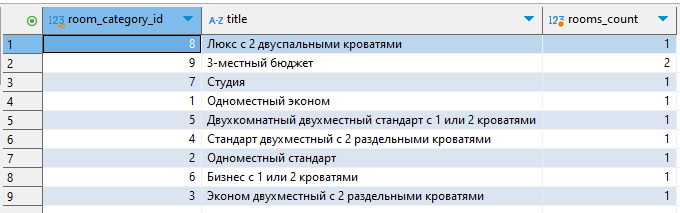
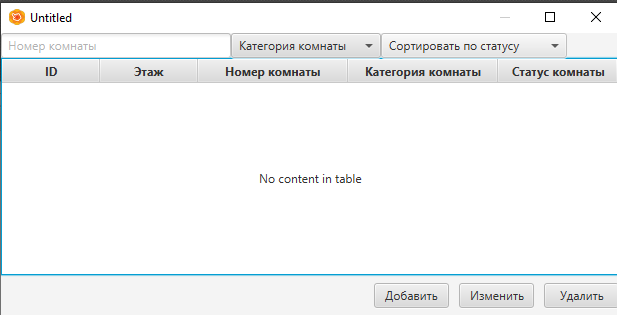

# Задание

# Критерии оценивания

Оценка 3 - Создать БД на сервере. Импортировать данные о товарах

Оценка 4 - В дополнении к первому пункут импортировать все данные, которые представлены в ресурсах

Оценка 5 - Разработать приложение согласно макету 

## Формулировка

1. На основании [описания брифинга и документов](Resources%20_090207-1-2025.zip), представленных заказчиком,
необходимо создать базу данных, используя предпочтительную платформу, на сервере баз данных, который вам
предоставлен. Создайте таблицы основных сущностей, атрибуты, отношения.

2. Заполните созданные таблицы начальными тестовыми
данными (не менее трех записей в каждую таблицу).

3. Создайте хранимую процедуру calculate_age,
которая на основе данных из таблицы clients
рассчитывает возраст каждого клиента.

4. Создайте триггер который, при попытке добавить в 
таблицу `bookings` бронь, проверяет что дата начала проживания `date_start` 
не позднее, чем дата выселения `date_end`. При возникновении такой ситуации триггер должен будет проинформировать
с выводом статуса `(SIGNAL SQLSTATE '45000')` и текстом сообщения `ERROR date_start cannot be after date_end`.

5. Создайте запрос, который на основе данных о комнатах 
выведет информацию о количестве комнат каждой из категории
комнат. Пример результата запроса представлен ниже.

6. Создайте модуль программного обеспечения, который
позволит анализировать информацию из созданной базы данных.
Макет окна представлен на рисунке.

**_Рисунок – Макет окна работы с бронированием номеров_**

Подключите к приложению созданную базу данных и реализуйте следующий функционал:
- Пользователь должен иметь возможность 
отсортировать комнаты по статусу. 
Кроме этого, пользователь должен иметь возможность
отфильтровать данные по категории комнат. 
Пользователь должен иметь возможность искать комнаты по номеру,
используя поисковую строку.
- Поиск, сортировка и фильтрация должны происходить
в реальном времени, без необходимости нажатия кнопки “найти”/ ”отфильтровать” и т.п. Фильтрация и поиск должны применяться совместно. Параметры сортировки, выбранные ранее пользователем, должны сохраняться и во время фильтрации с поиском

- добавление данных в таблицу комнаты с возможностью указания
всех данных, определенных на этапе проектирования базы данных в модуле 2.

Интерфейс этого окна разработайте самостоятельно;
- удаление данных из таблицы бронирование.

При разработке модуля соблюдайте требования к разработке.
Используйте отладку и обрабатывайте исключительные ситуации,
чтобы избежать фатальных ошибок при работе приложения. Ваше приложение
не должно завершаться аварийно.

