Предыдущее занятие |         &nbsp;          | Следующее занятие
:----------------:|:-----------------------:|:----------------:
[Задание 2](TASK2.MD) | [Содержание](README.MD) | [Задание 4](TASK4.MD)


# PostgreSQL Создание хранимых функций 

Summary: в этом уроке мы изучим как использовать конструкцию `CREATE FUNCTION` для добавления пользовательских функций(user-defined functions).


## Введение в оператор создания функции

Оператор создания функции(`CREATE FUNCTION`) позволяет определить новую пользовательскую функцию.

Вот синтаксис оператора создания функции:

```sql
CREATE [OR REPLACE] FUNCTION function_name(param_list)
   RETURNS return_type
   LANGUAGE plpgsql
  AS
$$
DECLARE
   -- variable declaration
BEGIN
   -- logic
END;
$$;
```

Разберем синтаксис:

* После ключевых слов `CREATE [OR REPLACE] FUNCTION` указывается имя функции `function_name`. Чтобы заменить существующую функцию, используйте опцию `[OR REPLACE]`.
* Затем после имени функции перечисляются параметры(можно указать тип параметров), заключенные в круглые скобки. Функция может вообще не иметь параметров.
* Затем после ключевого слова `RETURN` определяется тип данных возвращаемого значения.
* После этого используется конструкция `LANGUAGE plpgsql`, чтобы указать процедурный язык функции. Обратите внимание, что `PostgreSQL` поддерживает множество языков, включая `plpgsql`.
* [Тело функции](https://neon.tech/postgresql/postgresql-plpgsql/dollar-quoted-string-constants) помещается в строковую константу, заключенную в долларовые кавычки `$$`.

## PostgreSQL Пример создания фукнции

Возьмем таблицу room_categories из нашей БД.

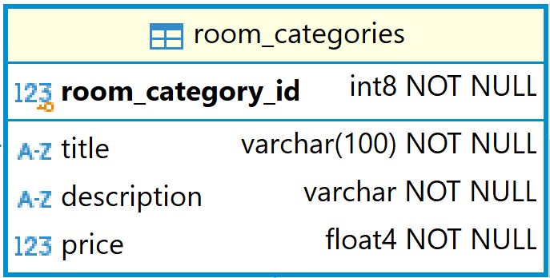

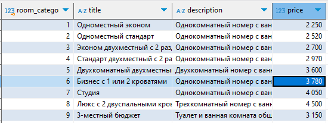

Посчитаем сколько у нас категории комнат, стоимость которых в пределах переданных значений.

```sql

CREATE FUNCTION get_room_categories_count(price_from float4, price_to float4)
RETURNS int
LANGUAGE plpgsql
AS
$$
DECLARE
   room_categories_count integer;
BEGIN
   SELECT  count(*)
   INTO room_categories_count
   FROM room_categories
   WHERE price BETWEEN price_from AND price_to;
   RETURN room_categories_count;
END;
$$;
```

Функция `get_room_categories_count` имеет два основных раздела:

* header(заголовок);
* body(тело).

В заголовке функции указаны:

* имя функции — `get_room_categories_count`, которое следует за ключевыми словами `CREATE FUNCTION`.
* функция `get_room_categories_count` принимает два параметра `price_from` и `price_to` вещественного типа.
* функция `get_room_categories_count` возвращает целое число, указанное в предложении `RETURNS int`.
* Наконец, языком функции является `plpgsql`, обозначенный `LANGUAGE plpgsql`.

В теле функции:

* Используйте синтаксис строковой константы в долларовых кавычках, который начинается с $$ и заканчивается на $$. 
Между этими $$ можно разместить блок, содержащий объявление и логику функции.
* В разделе объявлений объявите переменную `room_categories_count`, в которой будет храниться количество категорий
из таблицы `room_categories`.
* В теле блока используйте оператор `SELECT INTO`, чтобы выбрать количество категорий, 
стоимость которых находится между `price_from` и `price_to`, и присвоить его переменной `room_categories_count`.
В конце блока используйте оператор `RETURN`, чтобы вернуть количество категорий.

Чтобы выполнить оператор создания функции, вы можете использовать любой клиентский инструмент PostgreSQL, 
включая psql, pgAdmin или DBeaver.

## Создание функции используя DBeaver

1. Запустите DBeaver и подключитесь к своей БД.
2. Нажмите правой кнопкой по названию вашей БД.
3. В контекстном меню выберите **Редактор SQL\Новый редактор SQL**.

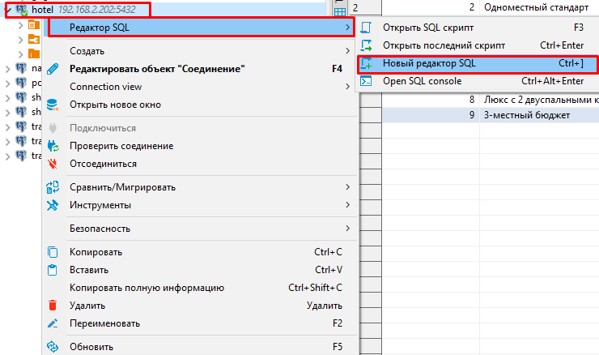

4. Скопируйте код функции и вставьте его в окно нового редактора SQL

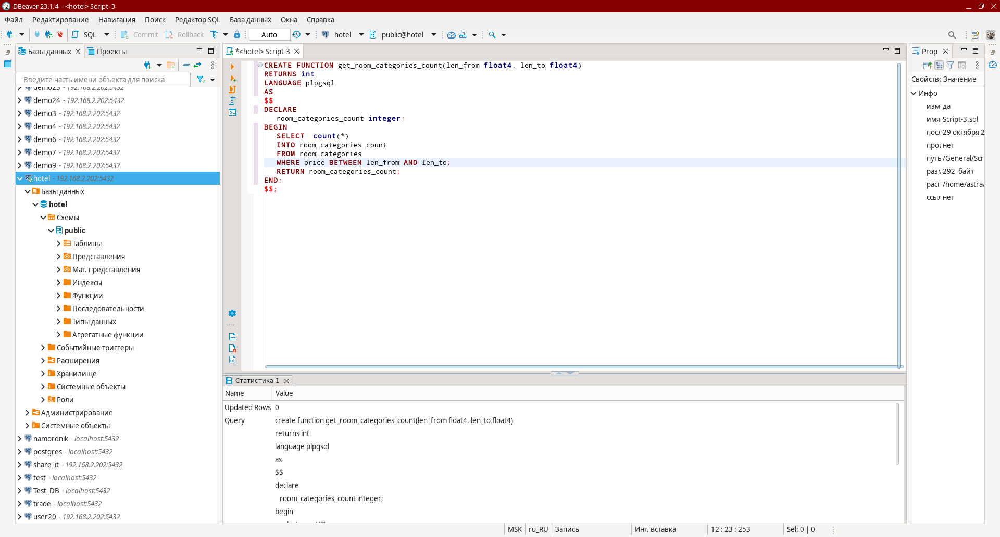

5. Выполните запрос нажав на кнопку Выполнить SQL-запрос

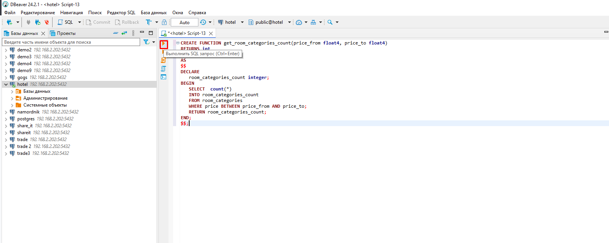

6. Если все правильно, будет выполнен запрос и внизу отобразится результат

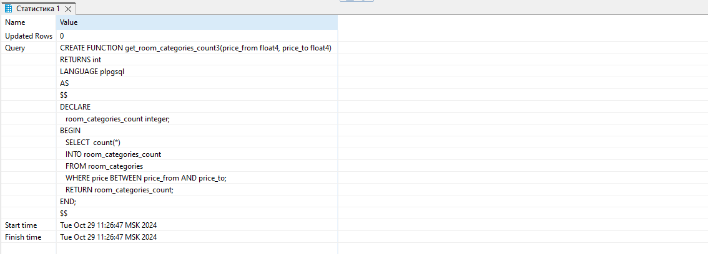

Это означает, что функция `get_room_categories_count` успешно создана.

7. Найдите функцию get_room_categories_count в списке функций вашей схемы БД:

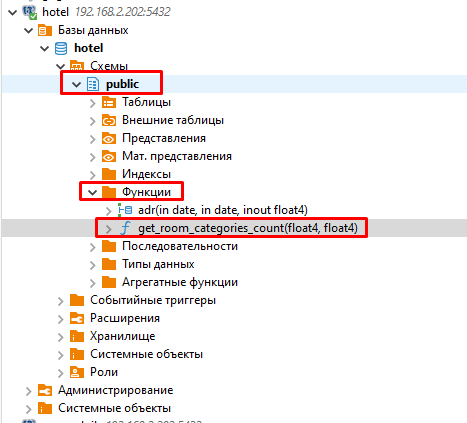

8. Если функция не отображается, то обновите список функций. Для этого нажмите правой кнокой мыши по папке **Функции** и в контекстном меню выберите пункт **Обновить**.

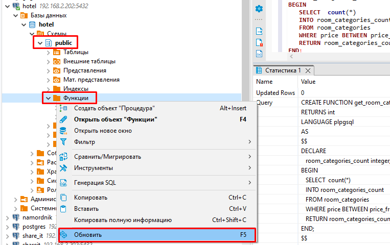


# Вызов пользовательских функций

Для того чтобы вызвать пользовательс

PostgreSQL реализует три способа передачи параметров в фукнцию:

* позицинная нотация;
* именованная нотация;
* смешанная.

> Именованная запись особенно полезна для функций с большим количеством параметров, поскольку она делает связи между параметрами и фактическими аргументами более явными и надежными. В позиционной нотации вызов функции записывается со значениями аргументов в том же порядке, в котором они определены в объявлении функции. В именованной нотации аргументы сопоставляются с параметрами функции по имени и могут быть записаны в любом порядке. Для каждой нотации также учитывайте влияние типов аргументов функций.

> В любой нотации параметры со значениями по умолчанию, заданными в объявлении функции, вообще не нужно записывать в вызове. Но это особенно полезно в именованной нотации, поскольку можно опустить любую комбинацию параметров; в то время как в позиционной записи параметры могут быть опущены только справа налево.

> PostgreSQL также поддерживает смешанную нотацию, которая сочетает в себе позиционную и именованную нотацию. В этом случае позиционные параметры записываются первыми, а именованные параметры идут после них.

### Пример вызова функции в позиционной нотации

>При вызове функции с использованием позиционной записи вам необходимо указывать аргументы в том порядке, в котором параметры определены в сигнатуре функции

```sql
SELECT get_room_categories_count(2000, 3000);
```
результат

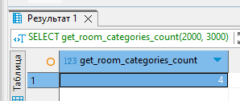


### Пример вызова функции в именованной нотации

```sql
SELECT get_room_categories_count(price_to := 3000, price_from := 2000);
```
или

```sql
SELECT get_room_categories_count(price_to => 3000, price_from => 2000);
```

результат

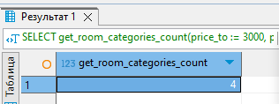

В именованной записи следует использовать символы `=>` или `:=` для разделения имени аргумента и его значения.
Аргументы теперь, могут быть записаны в любом порядке.


### Пример вызова функции в смешанной нотации

>Смешанная нотация представляет собой комбинацию позиционных и именованных нотаций. Например:

```sql
SELECT get_room_categories_count(1500, price_to => 2300);
```
результат

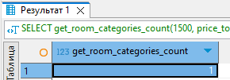

> Обратите внимание, что вы не можете использовать именованные аргументы перед позиционными аргументами, например:

 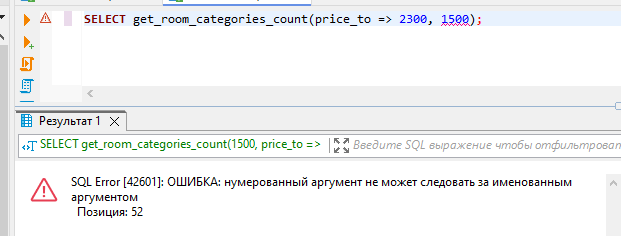


# Задания 


[Учетные данные 215 Группа](docs/215.md)

[Учетные данные 217 Группа](docs/217.md)

1. Создайте функцию get_room_categories_count согласно примеру. Протестируйте его.

2. Изучите дополнительную информацию о входных и выходных параметрах из [статьи](https://neon.tech/postgresql/postgresql-plpgsql/plpgsql-function-parameters).

3. Создайте хранимые функции:
   * функция, которая возвращает количество клиентов родившихся не ранее заданной даты
   * функция, которая возвращает количество клиентов родившихся не позднее заданной даты
   * функция, которая возвращает количество клиентов, дата рождения которых находится в пределах заданных дат.
   * функция, которая возвращает стоимость и название самой дорогой дополнительной услуги.
   * функция, которая возвращает стоимость и название самой дешевой дополнительной услуги.
   * функция, которая возвращает стоимость и название самого дорогой категории номеров.
   * функция, которая возвращает стоимость и название самого дешевой категории номера.
   
4. Отправьте скрипты, созданных функций в репозиторий на gogs-сервер(назовите репозиторий **UP04_TASK3**).

## Критерии оценивания

* На оценку 5(отлично) - Создана функция get_room_categories_count согласно примеру. Созданы все функции, которые нужно сделать по заданию.
* На оценку 4(хорошо) - Создана функция get_room_categories_count согласно примеру. Созданы любые пять функции, которые нужно было сделать по заданию.
* На оценку 3(удовл) - Создана функция get_room_categories_count согласно примеру. Созданы любые три функции, которые нужно было сделать по заданию.


