Предыдущее занятие |         &nbsp;          | Следующее занятие
:----------------:|:-----------------------:|:----------------:
[Задание 3](TASK3.MD) | [Содержание](README.MD) | [Задание 5](TASK5.MD)


# PostgreSQL. Хранимая процедура ADR и триггеры

1. [ADR](#adr)
    * [Фрагмент задания из ДЭ 2025](#фрагмент-задания-из-дэ-2025)
    * [ADR - простая версия](#adr---простая-версия)
    * [ADR - сложная версия](#adr---сложная-версия)
    * [ADR - разделение на две отдельные функции](#adr---разделение-на-два-отдельных-запроса)
2. [Триггеры](#триггеры)
    * [Что такое триггер](#что-такое-триггер)
    * [Типы триггеров PostgreSQL]
    * [Когда использовать триггеры]
3. [Создание триггера]
   * [Триггерная функция]
   * [Синтаксис триггера]
   * [Пример]
4. []
   * []
   * []
## ADR

### Фрагмент задания из ДЭ 2025

> Создайте процедуру, которая вычисляет показатель для расчета эффективности работы гостиницы `ADR (Average Daily Rate)`. Показывает
> среднюю стоимость номера за некий промежуток времени. Показатель
> получается за счет деления чистой выручки от продаж номерного фонда
(после вычета скидок, косвенных налогов, стоимости завтраков и т.п.) на
> общее количество проданных за рассматриваемый период номеров. Другими
> словами, данный показатель равен отношению суммы продаж к числу ночей.

### `ADR` - простая версия


```sql
CREATE FUNCTION get_adr(date_s date, date_e date)
RETURNS real
LANGUAGE plpgsql
AS
$$
DECLARE
   adr_result real;
BEGIN
   SELECT sum(t.total_price) / sum(t.days) AS avg  
   INTO adr_result
	FROM
   (SELECT 
	b.booking_id,
	b.date_start,
	b.date_end, 
	rc.price, 
	DATE_PART('day', b.date_end::timestamp - b.date_start ::timestamp) AS days,
	DATE_PART('day', b.date_end::timestamp - b.date_start ::timestamp) * price 
	AS total_price FROM bookings b JOIN rooms r ON b.room_id = r.room_id 
	JOIN room_categories rc ON r.room_category_id = rc.room_category_id
	WHERE b.date_start>= date_s AND b.date_end <= date_e AND b.date_end NOTNULL) AS t;
	RETURN avg_result;
END;
$$;
```

Формируется запрос, который выбирает из соединения таблиц `bookings + rooms + category_rooms` только те
записи _дата начала проживания_ **больше или равна** _началу интервала_ и при этом
_дата окончания проживания_ **меньше или равна** _концу интервала временного_ промежутка.

С помощью команды `DATE_PART('day', b.date_end::timestamp - b.date_start ::timestamp)` находится количество дней между двумя датами.


### `ADR` - сложная версия

```sql
CREATE OR REPLACE FUNCTION get_avg_hard_full_version(from_start_date date, to_end_date date)
RETURNS real
LANGUAGE plpgsql
AS $$
DECLARE
   adr_result real;
BEGIN
    SELECT 
		sum(t.price * DATE_PART('day', t.end_date::timestamp - t.start_date ::timestamp)) / 
			NULLIF(sum(DATE_PART('day', t.end_date::timestamp - t.start_date ::timestamp)), 0) AS adr_value   
   INTO adr_result
	FROM
   (SELECT 
	b.booking_id,
	rc.price AS price, 
	CASE WHEN b.date_start > from_start_date THEN b.date_start
	ELSE from_start_date
	END AS start_date,
	CASE WHEN b.date_end < to_end_date THEN b.date_end
	ELSE to_end_date
	END AS end_date
	FROM bookings b JOIN rooms r ON b.room_id = r.room_id 
	JOIN room_categories rc ON r.room_category_id = rc.room_category_id
	WHERE ((b.date_end >= from_start_date AND b.date_end <= to_end_date) 
				OR  (b.date_start>= from_start_date AND b.date_start <= to_end_date)) 
				AND b.date_end NOTNULL) AS t;
	RETURN adr_result;
END;
$$;
```

В этом варианте запрос имеет более сложную логику.
Формируется запрос, который выбирает из соединения таблиц `bookings + rooms + category_rooms` те
записи для которых выполняется следующее условие:

```
((from_start_date <= дата начала проживания <= to_end_date) ИЛИ (from_start_date <= дата окончания проживания <= to_end_date)) 
И (дата окончания проживания НЕ ПУСТОЕ)
```

Вначале в результирующую таблицу передается следующая информация:
* booking_id
* price - стоимость комнаты за сутки
* start_date (выполняется сравнение переданной в функцию даты `from_start_date` с той, которая будет получена у брони `date_start`. 
 Если `date_start > from_start_date`, то в качестве значения для `start_date` берется значение `date_start` у брони, иначе берется значение `from_start_date`)
* end_date (выполняется сравнение переданной даты `to_end_date` с той, которая будет получена у брони `date_end`. 
 Если `to_end_date > date_end`, то в качестве значения для `end_date` берется значение `date_end` у брони, иначе берется значение `to_end_date`)
 
Далее результат анализируется следующим образом:

* `DATE_PART('day', t.end_date::timestamp - t.start_date ::timestamp)` - эта команда позволяет получить разницу в днях между двумя датами.
*  `t.price * DATE_PART('day', t.end_date::timestamp - t.start_date ::timestamp)` - стоимость за съем номера на n-дней.
* `NULLIF(sum(DATE_PART('day', t.end_date::timestamp - t.start_date ::timestamp)), 0)` - позволяет проверить не равно ли количество дней 0. В этом случае результат будет 0.
* Итоговый результат мы рассчитываем по формуле `сумма_продаж / число_ночей` т.е. 

```
sum(t.price * DATE_PART('day', t.end_date::timestamp - t.start_date ::timestamp)) / 
			NULLIF(sum(DATE_PART('day', t.end_date::timestamp - t.start_date ::timestamp)), 0)
```


### `ADR` - разделение на два отдельных запроса

Можно разбить описанную выше функцию на две небольшие.

> get_bookings(from_start_date date, to_end_date date) - запрос который возвращает список действующих заказов в рамках указанного периода 

```sql
-- DROP FUNCTION get_bookings(date, date);

CREATE OR REPLACE FUNCTION get_bookings(from_start_date date, to_end_date date)
 RETURNS TABLE(booking_id bigint, price real, start_date date, end_date date)
 LANGUAGE plpgsql
AS $function$
BEGIN
	RETURN query
		SELECT 
			b.booking_id,
			rc.price AS price, 
			CASE WHEN b.date_start > from_start_date 
				THEN b.date_start
				ELSE from_start_date
			END AS start_date,
			CASE WHEN b.date_end < to_end_date 
				THEN b.date_end
				ELSE to_end_date
			END AS end_date
			
		FROM bookings b JOIN rooms r ON b.room_id = r.room_id 
				JOIN room_categories rc ON r.room_category_id = rc.room_category_id
		WHERE ((b.date_end >= from_start_date AND b.date_end <= to_end_date) 
				OR  (b.date_start>= from_start_date AND b.date_start <= to_end_date)) 
				AND b.date_end NOTNULL;
	
END;
$function$
;

```
> get_adr_hard_version(date_s date, date_e date) - вызывает функцию выше. 

```sql
-- DROP FUNCTION get_adr_hard_version(date, date);

CREATE OR REPLACE FUNCTION get_adr_hard_version(date_s date, date_e date)
 RETURNS real
 LANGUAGE plpgsql
AS $function$
DECLARE
   adr_result decimal(10,2);
BEGIN
   SELECT sum(t.price * DATE_PART('day', t.end_date::timestamp - t.start_date ::timestamp)) /
      NULLIF(sum(DATE_PART('day', t.end_date::timestamp - t.start_date ::timestamp)), 0) AS avg  
   INTO adr_result
	FROM get_bookings(date_s, date_e) AS t;
	RETURN adr_result;
END;
$function$
;

```


#  Триггеры

[Дополнительный материал](https://neon.tech/postgresql/postgresql-triggers/introduction-postgresql-trigger)

## Что такое триггер
Триггер PostgreSQL — это функция, которая вызывается автоматически всякий раз, когда происходит событие, связанное с таблицей. 
Событие может быть любым из следующих: `INSERT`, `UPDATE`, `DELETE` или `TRUNCATE`.

Триггер — это специальная определяемая пользовательская функция, связанная с таблицей. 
Чтобы создать новый триггер, сначала нужно определить функцию триггера, а затем привязать эту функцию триггера к таблице.

Разница между триггером и пользовательской функцией заключается в том, что триггер автоматически вызывается при возникновении события, вызывающего срабатывание.

## Типы триггеров PostgreSQL
PostgreSQL предоставляет два основных типа триггеров:

* Триггеры на уровне строк(`FOR EACH ROW`) - **триггеры строк**.
* Триггеры на уровне утверждений(`STATEMENT`) - **операторный триггер**.

Различия между этими двумя типами заключаются в том, сколько раз триггер вызывается и в какое время.

Например, если вы выполните `UPDATE` оператор, который изменяет 20 строк, **триггер строк** будет вызван 20 раз, 
тогда как **операторный триггер** будет вызван 1 раз.

Вы можете указать, будет ли триггер вызываться до или после события. 
Если триггер вызывается до события, он может пропустить операцию для текущей строки или даже изменить 
обновляемую или вставляемую строку. В случае, если триггер вызывается после события, 
все изменения доступны триггеру.

## Когда использовать триггеры
Триггеры полезны в случае, если к базе данных обращаются различные приложения,
и вы хотите сохранить кросс-функциональность в базе данных,
которая запускается автоматически при изменении данных таблицы. 
Например, если вы хотите сохранить историю данных, не требуя от приложения иметь логику для проверки каждого события,
например `INSERT` или `UDPATE`.

Также вы можете использовать триггеры для поддержания 
сложных правил целостности данных, которые не могут быть реализованы нигде, кроме как на уровне базы данных. 
Например, когда в таблицу добавляется новая строка `customer`, в таблицах банков и кредитов должны быть также созданы 
другие строки.

Главным недостатком использования триггера является то, 
что для определения последствий изменения данных необходимо знать о существовании триггера и понимать его логику.

---

# Создание триггера 

Чтобы создать новый триггер в PostgreSQL, выполните следующие действия:

* Сначала создайте функцию-триггер с помощью `CREATE FUNCTION` оператора.
* Во-вторых, привяжите функцию триггера к таблице с помощью `CREATE TRIGGER` оператора.

Если вы не знакомы с созданием пользовательских функций, вы можете ознакомиться с информацией в прошлом уроке [Урок 3](TASK3.MD).

## Синтаксис создания триггерной функции

Триггерная функция похожа на обычную пользовательскую функцию. 
Однако триггерная функция **не принимает никаких аргументов** и имеет возвращаемое значение с типом `TRIGGER`.


Ниже показан синтаксис создания триггерной функции:

```sql
CREATE FUNCTION trigger_function_name()
   RETURNS TRIGGER
   LANGUAGE PLPGSQL
AS $$
[DECLARE 
    {Объявление перемнных}]
BEGIN
   {тело функции}
   RETURN NEW | OLD | NULL
END;
$$
```
Триггерная функция должна вернуть либо `NULL`, либо строку таблицы, для которой сработал триггер. Триггерная функция, которая вызывается 
**операторным триггером** всегда должна возвращать `NULL`.

Триггерные функции, вызываемые **триггерами строк**, должны возвращать:
* `NEW` - для операций `INSERT` и `UPDATE`;
* `OLD` - для операций `DELETE`;
* `NULL` - если эти операции не выполнялись(строка была пропущена) 

В теле триггерной функции можно использовать специальные переменные, которые содержат данные о сработавшем триггере и связанном с ним объектом.

 **Имя** | **Тип данных** | **Описание**
:-------:|:--------------:|:----------------:
|   NEW   |     record     | для триггеров уровня строки содержит новую запись, которая должна стать результатом операции `INSERT/UPDATE`. Для команды `DELETE` и в **операторных триггерах** имеет значение `NULL`.
|OLD|     record     | для триггеров уровня строки содержит старую запись, до выполнения `UPDATE/DELETE`. Для команды `INSERT` и в **операторных триггерах** имеет значение `NULL`
|TG_NAME|      name      | имя триггера
|TG_WHEN|      text      | может содержать BEFORE, AFTER или INSTEAD OF — условие выполнения функции: до, после или вместо операции.
|TG_LEVEL|      text      |тип триггера: **триггер строк** (`ROW`) или `операторный триггер` (`STATEMENT`)
|TG_OP|      text      | операция, для которой запускается триггерная функция: INSERT, UPDATE, DELETE или TRUNCATE.
|TG_TABLE_NAME|name|таблица, для которой сработал триггер.
|TG_TABLE_SCHEMA|name|схема таблицы, для которой сработал триггер/


В триггерных функциях можно использовать функции и операторы предоставления системной информации. 

 **Имя** | **Тип данных** | **Описание**
:-------:|:--------------:|:----------------:
|   CURRENT_DATABASE()   |     name     | Возвращает имя текущей БД.
| CURRENT_SCHEMA |     name     | Возвращает имя схемы.
|CURRENT_USER |      name      | Возвращает имя пользователя
|CURRENT_QUERY() |      text      | Возвращает текст выполняемого в данный момент запроса.


## Синтаксис триггера

Оператор `CREATE TRIGGER` позволяет создать новый триггер.

Ниже показан основной синтаксис `CREATE TRIGGER`:

```sql
CREATE [OR REPLACE] TRIGGER {имя триггера}
{момент срабатывания} {событие} ON {имя таблицы}
[FOR EACH ROW]
EXECUTE PROCEDURE trigger_function_name();

```
 
После ключевых слов `CREATE [OR REPLACE] TRIGGER` указывается {имя триггера}.

Далее указывается `{момент срабатывания}`, который будет вызывать срабатывание триггера:
* `BEFORE` - перед выполнением оператора;
* `AFTER` - после выполнением оператора;

Параметр `{событие}` - это выполнение операторов DML: INSERT, DELETE, UPDATE или TRUNCATE.

После ключевого слова `ON` указывается имя таблицы, связанной с триггером.

Далее задается тип триггера, которые могут быть. 

> Если фраза `FOR EACH ROW` отсутствует, то такой триггер называется **операторным**, и он будет срабатывать один раз.

> При наличии фразы FOR EACH ROW` триггер называется **триггером строк**, и он будет выполняться для 
> каждой строки, к которой будет применен оператор DML/


Предположим, что таблица содержит 100 строк и два триггера, которые срабатывают при возникновении события DELETE.
Если DELETE оператор удаляет 100 строк, **триггер строк** сработает 100 раз, по одному разу для каждой удаленной строки. 
С другой стороны, **операторный триггер** сработает один раз, независимо от того, сколько строк удалено.

Наконец, после ключевых слов `EXECUTE PROCEDURE` указывается имя **триггерной функции**.

## Пример

Создадим триггер, который будет срабатывать при добавлении записи в таблицу `bookings`.
По логике работы, при добавлении записи в эту таблицу, комната(room) с которой связана это бронирование должна сменить статус с `Чистый` на `Занят`.
Наш триггер будет срабатывать при добавлении (`INSERT`) в таблицу bookings и менять статус, связанной с ним комнаты с `Чистый` на `Занят`.

Для начала создадим триггерную функцию.

```sql
    CREATE OR REPLACE FUNCTION reserve_room()
       RETURNS TRIGGER
       LANGUAGE PLPGSQL
    AS $$
    BEGIN
       UPDATE rooms r SET room_status_id = (
       SELECT room_status_id FROM room_status rs WHERE rs.title = 'Занят')
       WHERE r.room_id = NEW.room_id;
       RETURN NEW;
    END;
    $$
```
Выполните запрос.

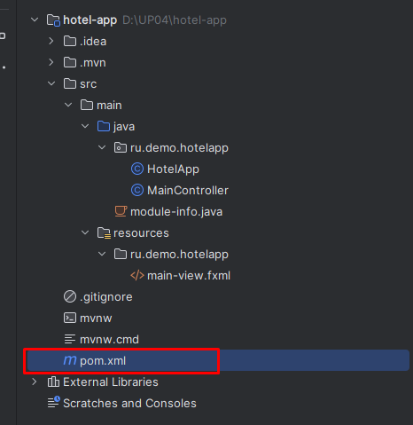

Если код корректный, то будет получен результат 


В списке функции вашей схемы должна появиться функция reserve_room().

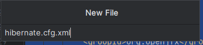

Теперь создадим **триггер строк**

```sql
    CREATE OR REPLACE TRIGGER set_reserve_rooms
    AFTER INSERT ON bookings
    FOR EACH ROW 
    EXECUTE FUNCTION reserve_room();

```
Выполните запрос. 


Если код корректный, то будет получен результат 


Если теперь в обзоре открыть таблицу `bookings` и посмотреть на список триггеров, там должен отобразиться триггер `set_reserve_rooms`

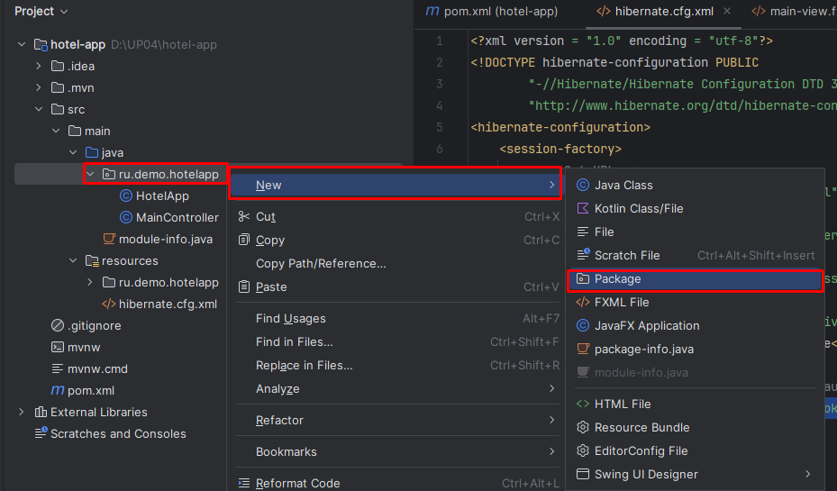


## Тестирование триггера

Предположим таблицы содержат следующие данные

**room_status**

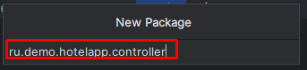

**rooms**

В таблице `rooms` есть только одна комната 203, у которой room_id = 6, которая имеет статус чистый, т.е room_status_id = 3.

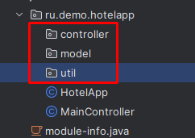

**bookings**

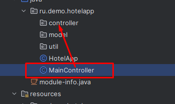

Добавим в таблицу bookings новую запись. Поселим клиента в комнату 203.
Созданный нами ранее триггер set_reserve_rooms должен будет изменить статус этой комнаты на `Занят`, 
т.е. room_status_id должен будет поменять свое значение на **2**.

Создайте новый SQL запрос
```sql
INSERT INTO bookings(client_id, date_start, date_end, room_id) 
			VALUES (4, '2024-10-29','2024-11-03', 6)
```

Выполните его. Если ошибок в запросе нет, то отобразится окно с результатом выполнения запроса


Посмотрим на изменения в БД. В таблице bookings должна появиться новая запись 


Если триггер был создан корректно, то он также обновит статус комнаты 203 с room_id = 6 на room_status_id = 3.


# Триггер из задания ДЭ 2025 

## Задание

> Создайте триггер, который при попытке бронирования будет проверять наличие свободных номеров с выводом статуса `(SIGNAL SQLSTATE '45000')`.

Нам нужно будет создать **операторный триггер**(STATEMENT), который будет срабатывать перед(BEFORE) добалении(INSERT) записи в таблицу bookings.

Для начала создадим триггерную функцию.

```sql
-- Триггерная функция, которая проверяет есть ли доступные комнаты
-- если пустых комнат нет, то то генерируется ошибка с кодом 45000 и сообщением
-- свободных комнат нет
CREATE OR REPLACE FUNCTION check_free_rooms()
   RETURNS TRIGGER
   LANGUAGE PLPGSQL
AS $$
	DECLARE	 rooms_count integer;
BEGIN
-- подсчитываем количество свободных комнат(комнаты, в которые можно заселить имеют статус Чистый) 
   SELECT count(*) 
   INTO rooms_count
   FROM rooms r JOIN room_status rs ON r.room_status_id = rs.room_status_id 
   WHERE rs.title = 'Чистый'; 
-- если чистых комнат нет, то генерируется ошибка с кодом 45000 и сообщением
-- свободных комнат нет
   IF rooms_count = 0 THEN
   		RAISE SQLSTATE '45000' USING MESSAGE = 'ALL ROOMS RESERVED';
   END IF;
   ---
   RETURN NULL;
END;
$$

```
Выполните его. Если ошибок в запросе нет, то отобразится окно с результатом выполнения запроса

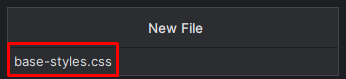

Теперь создадим триггер

```sql
-- Операторный триггер, вызывается единожды при попытке добавить запись в bookings
CREATE OR REPLACE TRIGGER check_rooms
BEFORE INSERT ON bookings 
EXECUTE FUNCTION check_free_rooms();
```

Выполните его. Если ошибок в запросе нет, то отобразится окно с результатом выполнения запроса

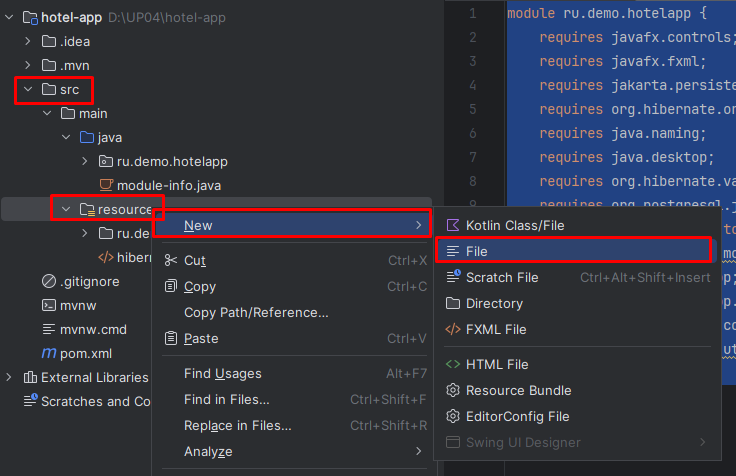

## Тестирование работы триггера.

### Тестирование добавления при наличии свободных номеров

Предположим таблицы содержат следующие данные

**room_status**


**rooms**

В таблице `rooms` есть только одна комната 203, у которой room_id = 6, которая имеет статус чистый, т.е room_status_id = 3.


**bookings**


Добавим в таблицу bookings новую запись. Поселим клиента в комнату 203.
Созданный нами ранее триггер set_reserve_rooms должен будет изменить статус этой комнаты на `Занят`, 
т.е. room_status_id должен будет поменять свое значение на **2**.

Создайте новый SQL запрос
```sql
INSERT INTO bookings(client_id, date_start, date_end, room_id) 
			VALUES (4, '2024-10-29','2024-11-03', 6)
```

Выполните его. Если ошибок в запросе нет, то отобразится окно с результатом выполнения запроса


Посмотрим на изменения в БД. В таблице bookings должна появиться новая запись 


Наши два триггера `check_rooms` и `set_reserve_rooms` отработают корректно.
check_rooms проверит наличие свободных номеров. И так как сободные номера есть, то ошибки не возникнет.
Далее после добавления записи в таблицу bookings новой записи запутится триггер set_reserve_rooms, который обновит статус комнаты 203 с room_id = 6 на room_status_id = 3.


### Тестирование добавления при отсутствии свободных номеров

В таблице rooms нет свободных(Чистый) номеров.


Теперь снова попробуем выполнить тот же самый запрос на добавление записи в таблицу bookings.

```sql
INSERT INTO bookings(client_id, date_start, date_end, room_id) 
			VALUES (4, '2024-10-29','2024-11-03', 6)
```

При попытке выполнить наш запрос мы получим ошибку 45000 с текстом `ALL ROOMS RESERVED`,

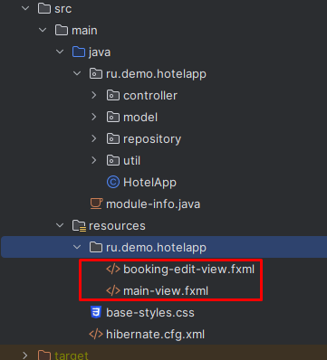

Сработал наш триггер `check_rooms`, который проверил наличие свободных номеров. 
Так как свободных(`Чистый`) номеров нет была сгенерирована ошибка SQLState с кодом 45000 и текстом `ALL ROOMS RESERVED`.


# Триггер из задания ДЭ 2025 - улучшенная версия

Можно добавить другую версию этого триггера. 
> Создайте триггер, который при попытке бронирования будет 
> проверять является ли номер, в который осуществляется бронь свободным.
> Если комната не свободна, должна быть сгенерирована ошибка с выводом статуса `(SIGNAL SQLSTATE '45000')`.

Нам нужно будет создать **триггер строк**(ROW), который будет срабатывать перед(BEFORE) добалении(INSERT) записи в таблицу bookings.

Для начала создадим триггерную функцию.

```sql
CREATE OR REPLACE FUNCTION is_current_room_free()
   RETURNS TRIGGER
   LANGUAGE PLPGSQL
AS $$
	DECLARE	 rooms_count integer;
BEGIN
   SELECT count(*) 
   INTO rooms_count
   FROM rooms r JOIN room_status rs ON r.room_status_id = rs.room_status_id 
   WHERE rs.title = 'Чистый' AND r.room_id = NEW.room_id;
   IF rooms_count = 0 THEN
   		RAISE SQLSTATE '45000' USING MESSAGE = 'ROOM WITH ID ' || NEW.room_id || ' RESERVED';	
   END IF;
   RETURN NEW;
END;
$$
```
Выполните его. Если ошибок в запросе нет, то отобразится окно с результатом выполнения запроса

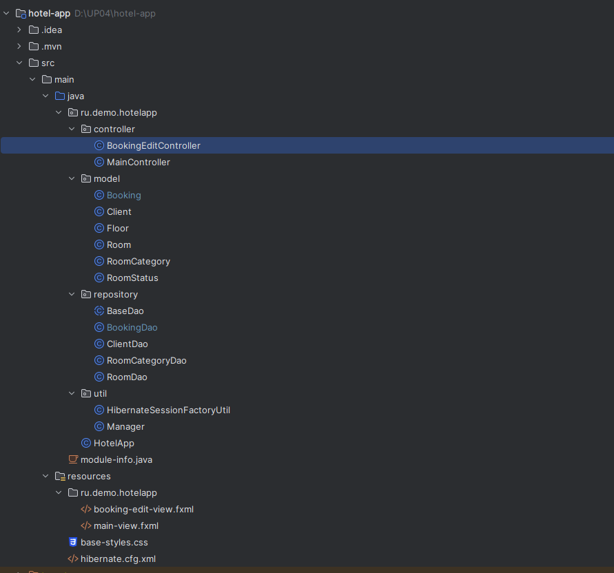

Теперь создадим триггер строк

```sql
CREATE OR REPLACE TRIGGER check_current_rooms
BEFORE INSERT ON bookings
FOR EACH ROW 
EXECUTE FUNCTION is_current_room_free();
```

Выполните его. Если ошибок в запросе нет, то отобразится окно с результатом выполнения запроса


## Тестирование работы триггера

Так как наш новый триггер `check_current_rooms` и `check_rooms` срабатывают при наступлении одних и тех же условий, 
нам придется удалить check_rooms из списка триггеров таблицы `bookings`.

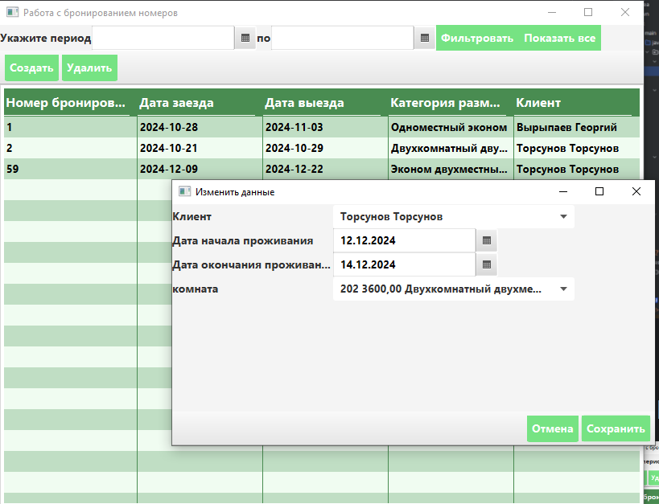


### Тестирование добавления при наличии свободных номеров

Предположим таблицы содержат следующие данные

**room_status**


**rooms**

В таблице `rooms` есть только одна комната 203, у которой room_id = 6, которая имеет статус чистый, т.е room_status_id = 3.


**bookings**


Добавим в таблицу bookings новую запись. Поселим клиента в комнату 203.
Созданный нами ранее триггер set_reserve_rooms должен будет изменить статус этой комнаты на `Занят`, 
т.е. room_status_id должен будет поменять свое значение на **2**.

Создайте новый SQL запрос
```sql
INSERT INTO bookings(client_id, date_start, date_end, room_id) 
			VALUES (4, '2024-10-29','2024-11-03', 6)
```

Выполните его. Если ошибок в запросе нет, то отобразится окно с результатом выполнения запроса


Посмотрим на изменения в БД. В таблице bookings должна появиться новая запись 


Наши два триггера `check_current_rooms` и `set_reserve_rooms` отработают корректно.
`check_current_rooms` проверит является ли комната с room_id = 6 свободной.
И так как комната свободна, то ошибки не возникнет. 
Далее после добавления записи в таблицу bookings новой записи запустится 
триггер set_reserve_rooms, который обновит статус комнаты 203 с room_id = 6 
на room_status_id = 2.


### Тестирование добавления при отсутствии свободных номеров

В таблице rooms нет свободных(Чистый) номеров.


Теперь снова попробуем выполнить тот же самый запрос на добавление записи в таблицу bookings.

```sql
INSERT INTO bookings(client_id, date_start, date_end, room_id) 
			VALUES (4, '2024-10-29','2024-11-03', 6)
```

При попытке выполнить наш запрос мы получим ошибку 45000 с текстом `ROOM WITH ID 6 RESERVED`,


Сработал наш триггер `check_current_rooms`, он проверил явлется ли комната с room_id = 6 свободной. 
Так как комната теперь имеет статус `Занят`, то была сгенерирована ошибка SQLState с кодом 45000 и текстом `ROOM WITH ID 6 RESERVED`.


# Задания

[Учетные данные 215 Группа](docs/215.md)

1. Создайте все версии хранимых процедур ADR согласно примеру. 
Напишите по три запроса для каждой функции и протестируйте. Результаты теста опишите в документ формата Word `ADR_tests.docx`, сопроводив скриншотами и скриптами.

2. Создайте триггеры  `set_reserve_rooms`, `check_rooms`, `check_current_rooms`. Протестируйте их работу.

3. Создайте и протестируйте триггеры:
   * при добавлении записи в таблицу rooms проверяет наличие комнаты с таким же номером number. 
   При наличии совпадения выводится статус `(SIGNAL SQLSTATE '42P08')` с текстом сообщения `Комната с номером [number] уже существует`   
   * при добавлении записи в таблицу clients проверяет наличие клиента с такими же серией и номером паспорта. 
   При наличии совпадения выводится статус `(SIGNAL SQLSTATE '42P08')` с текстом сообщения `Клиент с паспортными данными [passport_series] [passport_number] уже существует`
   * при удалении записи из таблицы bookings статус комнаты, которая связана с ней должна должен измениться на `Грязный`
   
4. Отправьте скрипты, созданных триггеров и на gogs-сервер(назовите репозиторий **UP04_TASK3**).

## Критерии оценивания

* На оценку 5(отлично) - Создана функция get_room_categories_count согласно примеру. Созданы все функции, которые нужно сделать по заданию.
* На оценку 4(хорошо) - Создана функция get_room_categories_count согласно примеру. Созданы любые пять функции, которые нужно было сделать по заданию.
* На оценку 3(удовл) - Создана функция get_room_categories_count согласно примеру. Созданы любые три функции, которые нужно было сделать по заданию.


