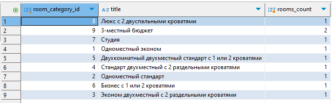
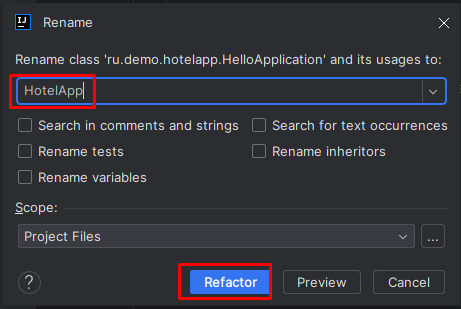
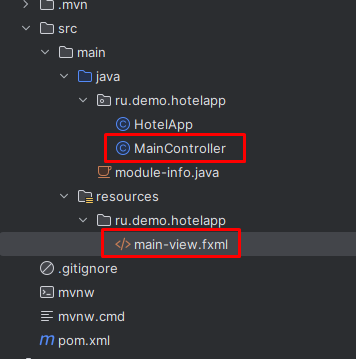
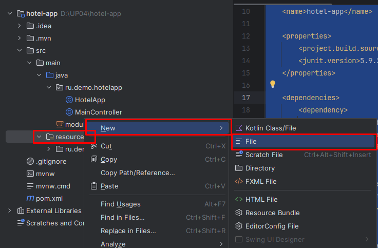
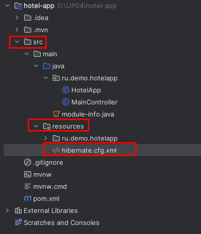
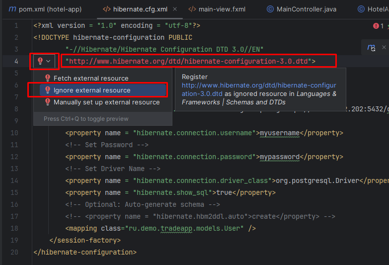
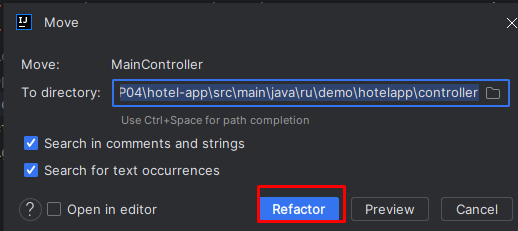
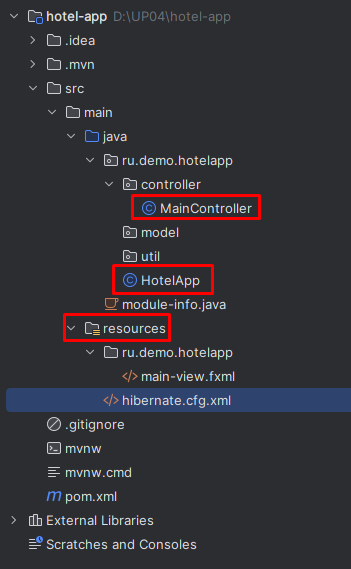
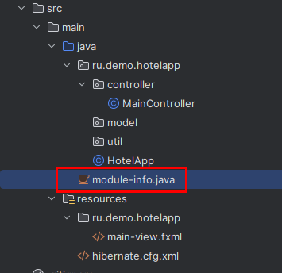
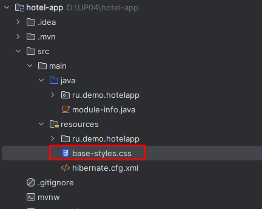

Предыдущее занятие | &nbsp; | Следующее занятие
:----------------:|:----------:|:----------------:
[Урок 1](Lesson1.md) | [Содержание](readme.md) | [Урок 3](Lesson3.md)

# Модуль №4: Разработка модулей программного обеспечения для компьютерных систем

## План
1. [Создание проекта](#создание-проекта)
2. [Настройка проекта](#настройка-проекта)
   * [pom.xml](#pomxml)
3. [Настройка подключения к БД](#настройка-подключения-к-бд)
   * [hibernate.cfg.xml](#hibernatecfgxml)
   * [module-info.java](#module-infojava)
   * [Настройка стилей base-styles.css](#base-stylescss)
   

# Текст задания

Создайте модуль программного обеспечения, который
позволит анализировать информацию из созданной базы данных.
Макет окна представлен на рисунке.


**_Рисунок – Макет окна работы с бронированием номеров_**

Подключите к приложению созданную базу данных и реализуйте следующий функционал:
- фильтрацию записей в таблице по указанному периоду. Пользователь указывает начало периода, конец периода
 и по нажатию кнопки «Фильтровать» должна происходить фильтрация данных в таблице, т. е.
отображаться бронирования, попадающие в указанный диапазон. По нажатию
на кнопку «Показать все» отменяется фильтрация записей;

- добавление данных в таблицу бронирование с возможностью указания
всех данных, определенных на этапе проектирования базы данных в модуле 2.
Интерфейс этого окна разработайте самостоятельно;
- удаление данных из таблицы бронирование.

При разработке модуля соблюдайте требования к разработке.
Используйте отладку и обрабатывайте исключительные ситуации,
чтобы избежать фатальных ошибок при работе приложения. Ваше приложение
не должно завершаться аварийно.

# Выполнение


2. Далее нажмите на кнопку `Create` 

## Создание проекта

1. Запустите IntelliJ IDEA.
2. Выберите слева вкладку **Projects**  и нажмите на кнопку **New Project**.


3. Создайте новое `Java FX` Приложение со следующими параметрами. 

Параметр |        Значение
:----------------:|:-----------------------:
Name: | hotel-app
Language: | Java
Build system: | Maven
Group: | ru.demo
Artifact: | hotel-app
JDK: | coretto-22 Amazon Coretto version



4. Если все настройки пройдены успешно появится окно с вашим проектом.

5. Откройте файл **HelloApplication.java**. Нажмите правой кнопкой мыши в любом месте программного кода и выберите в контекстном меню пункт Run HelloApplication.main()

6. После этого запустится форма с одной кнопкой.


Проект успешно создан.

## Настройка проекта

1. Выделите слева в окне файл HelloApplication.java. Нажмите правой кнопкой мыши и в контекстном меню выберите пункт Refactor/Rename.

2. В открывшемся окне в поле названия проекта вместо `HelloApplication` напишите `HotelApp` 
и нажмите на кнопку `Refactor`.



3. Аналогичным образом переименуйте файлы HelloController в MainController, а файл hello-view.fxml в 
main-view.fxml.



4. Откройте pom.xml файл 


5. замените его код на следующий.

### pom.xml
```xml
<?xml version="1.0" encoding="UTF-8"?>
<project xmlns="http://maven.apache.org/POM/4.0.0"
         xmlns:xsi="http://www.w3.org/2001/XMLSchema-instance"
         xsi:schemaLocation="http://maven.apache.org/POM/4.0.0 https://maven.apache.org/xsd/maven-4.0.0.xsd">
    <modelVersion>4.0.0</modelVersion>

    <groupId>ru.demo</groupId>
    <artifactId>hotel-app</artifactId>
    <version>1.0-SNAPSHOT</version>
    <name>hotel-app</name>

    <properties>
        <project.build.sourceEncoding>UTF-8</project.build.sourceEncoding>
        <junit.version>5.9.2</junit.version>
    </properties>

    <dependencies>
       <dependency>
            <groupId>org.hibernate.validator</groupId>
            <artifactId>hibernate-validator</artifactId>
            <version>8.0.1.Final</version>
        </dependency>
        <dependency>
            <groupId>org.hibernate.orm</groupId>
            <artifactId>hibernate-core</artifactId>
            <version>6.2.7.Final</version>
        </dependency>
        <dependency>
            <groupId>org.postgresql</groupId>
            <artifactId>postgresql</artifactId>
            <version>42.7.4</version>
        </dependency>
        <dependency>
            <groupId>org.openjfx</groupId>
            <artifactId>javafx-controls</artifactId>
            <version>17.0.6</version>
        </dependency>
        <dependency>
            <groupId>org.openjfx</groupId>
            <artifactId>javafx-fxml</artifactId>
            <version>17.0.6</version>
        </dependency>

        <dependency>
            <groupId>org.junit.jupiter</groupId>
            <artifactId>junit-jupiter-api</artifactId>
            <version>${junit.version}</version>
            <scope>test</scope>
        </dependency>
        <dependency>
            <groupId>org.junit.jupiter</groupId>
            <artifactId>junit-jupiter-engine</artifactId>
            <version>${junit.version}</version>
            <scope>test</scope>
        </dependency>
    </dependencies>

    <build>
        <plugins>
            <plugin>
                <groupId>org.apache.maven.plugins</groupId>
                <artifactId>maven-compiler-plugin</artifactId>
                <version>3.11.0</version>
                <configuration>
                    <source>22</source>
                    <target>22</target>
                </configuration>
            </plugin>
            <plugin>
                <groupId>org.openjfx</groupId>
                <artifactId>javafx-maven-plugin</artifactId>
                <version>0.0.8</version>
                <executions>
                    <execution>
                        <!-- Default configuration for running with: mvn clean javafx:run -->
                        <id>default-cli</id>
                        <configuration>
                            <mainClass>ru.demo.hotelapp/ru.demo.hotelapp.HotelApp</mainClass>
                            <launcher>app</launcher>
                            <jlinkZipName>app</jlinkZipName>
                            <jlinkImageName>app</jlinkImageName>
                            <noManPages>true</noManPages>
                            <stripDebug>true</stripDebug>
                            <noHeaderFiles>true</noHeaderFiles>
                        </configuration>
                    </execution>
                </executions>
            </plugin>
        </plugins>
    </build>
</project>
```

6. Далее справа нажмите на кнопку M


7. Далее в новом окошке нажмите на кнопку Reload All Maven Projects. Это нужно для того чтобы скачать пакеты в ваш проект.


## Настройка подключения к БД
1. Добавьте в папку resourses файл ```hibernate.cfg.xml```







добавьте в него следующий код

### hibernate.cfg.xml
```xml
<?xml version = "1.0" encoding = "utf-8"?>
<!DOCTYPE hibernate-configuration PUBLIC
        "-//Hibernate/Hibernate Configuration DTD 3.0//EN"
        "http://www.hibernate.org/dtd/hibernate-configuration-3.0.dtd">
<hibernate-configuration>
    <session-factory>
        <!-- Set URL -->
        <property name = "hibernate.connection.url">jdbc:postgresql://192.168.2.202:5432/databasename</property>
        <!-- Set User Name -->
        <property name = "hibernate.connection.username">myusername</property>
        <!-- Set Password -->
        <property name = "hibernate.connection.password">mypassword</property>
        <!-- Set Driver Name -->
        <property name = "hibernate.connection.driver_class">org.postgresql.Driver</property>
        <property name = "hibernate.show_sql">true</property>
        <!-- Optional: Auto-generate schema -->
        <!-- <property name = "hibernate.hbm2ddl.auto">create</property> -->
        <mapping class="ru.demo.hotelapp.model.Booking" />
    </session-factory>
</hibernate-configuration>

```
Вместо **databasename** - укажите название БД, с которой вы работаете. Вместо **myusername** и **mypassword** укажите логин и пароль соответственно.
Строка ```<mapping class="ru.trade.hotelapp.model.Booking" />``` указывает название файла класса, который будет ассоциирован с таблицей **bookings** из бд.
В дальнейшем по мере разработки приложения, мы будем добавлять в этот файл новые классы.

При возникновении ошибки возле строки 
` "http://www.hibernate.org/dtd/hibernate-configuration-3.0.dtd"`
установите курсор внутрь строки, далее наведите курсор мыши на красную лампочку слева от этой строки и в раскрывающемся списке выберите 
`ignore external resource`
П

2. Добавим в пакет ru.demo.hotelapp пакет controller. Для этого нажмите правой кнопкой мыши по пакету  ru.demo.hotelapp.
Далее в контекстном меню выберите New/Package


3. Укажите название пакета controller  и нажмите Enter.


4. Аналогичным образом добавьте еще три пакета model и util.


5. Простым перетаскиванием(выделите файл и удерживая левой кнопкой мыши) переместите файл
MainController.java в пакет controller.


6. Подтвердите перемещение нажав на кнопку **Refactor**



Должна получиться вот такая структура файлов



7. Откройте файл module-info.java.



8. Замените содержимое файла на следующий код

`module-info.java`

```java
module ru.demo.hotelapp {
    requires javafx.controls;
    requires javafx.fxml;
    requires jakarta.persistence;
    requires org.hibernate.orm.core;
    requires java.naming;
    requires java.desktop;
    requires org.hibernate.validator;
    requires org.postgresql.jdbc;
    opens ru.demo.hotelapp to javafx.fxml;
    opens ru.demo.hotelapp.model to org.hibernate.orm.core, javafx.base;
    exports ru.demo.hotelapp;
    exports ru.demo.hotelapp.controller;
    opens ru.demo.hotelapp.controller to javafx.fxml;
    opens ru.demo.hotelapp.util to org.hibernate.orm.core;
}
```
9. Добавьте в папку resources файл base-styles.css




10. Добавьте в него следующий программный код.

### base-styles.css
```css
.root {
     -fx-main-bg-color: #FFF;
     -fx-additional-bg-color: #04AA6D;
     -fx-akcent-bg-color: #04AA6D;
 }


.button {

  -fx-border-style: solid; /* Green */
  -fx-border-color: -fx-additional-bg-color;
  -fx-background-color: #FFF;
  -fx-padding: 5px 5x;
  -fx-text-fill: #04AA6D;
  -fx-text-align: center;
  -fx-display: inline-block;
  -fx-font-size: 16px;
  -fx-font-weight: bold;
}

.button:hover {
  -fx-background-color: white; /* Green */
  -fx-border-color: none;
  -fx-text-color: #04AA6D;
}

.text-field
{
  -fx-border-style: solid; /* Green */
  -fx-border-width: 0.1px; /* Green */
  -fx-border-color: black;

}

.header-label
{

    -fx-font-size: 18px;
    -fx-font-weight: bold;
    -fx-background-color: -fx-akcent-bg-color; /* Green */
    -fx-text-fill: #FFF;
}
```

11. Замените код файла HotelApp.java

```java
package ru.demo.hotelapp;

import javafx.application.Application;
import javafx.fxml.FXMLLoader;
import javafx.scene.Scene;
import javafx.stage.Stage;

import java.io.IOException;

public class HotelApp extends Application {
    @Override
    public void start(Stage stage) throws IOException {
        FXMLLoader fxmlLoader = new FXMLLoader(HotelApp.class.getResource("main-view.fxml"));
        Scene scene = new Scene(fxmlLoader.load(), 800, 600);
        scene.getStylesheets().add("base-styles.css");
        stage.setTitle("Работа с бронированием номеров");
        stage.setScene(scene);
        stage.show();
    }

    public static void main(String[] args) {
        launch();
    }
}
```

12. В resources создайте файл `booking-edit-view.fxml` и замените код


```fxml
<?xml version="1.0" encoding="UTF-8"?>

<?import javafx.scene.control.Button?>
<?import javafx.scene.control.ComboBox?>
<?import javafx.scene.control.DatePicker?>
<?import javafx.scene.control.Label?>
<?import javafx.scene.control.ToolBar?>
<?import javafx.scene.layout.AnchorPane?>
<?import javafx.scene.layout.BorderPane?>
<?import javafx.scene.layout.ColumnConstraints?>
<?import javafx.scene.layout.GridPane?>
<?import javafx.scene.layout.RowConstraints?>


<AnchorPane maxHeight="-Infinity" maxWidth="-Infinity" minHeight="-Infinity" minWidth="-Infinity" prefHeight="300.0" prefWidth="600.0" xmlns="http://javafx.com/javafx/22" xmlns:fx="http://javafx.com/fxml/1" fx:controller="ru.demo.hotelapp.controller.BookingEditController">
   <children>
      <BorderPane layoutX="210.0" layoutY="134.0" prefHeight="200.0" prefWidth="200.0" AnchorPane.bottomAnchor="0.0" AnchorPane.leftAnchor="0.0" AnchorPane.rightAnchor="0.0" AnchorPane.topAnchor="0.0">
         <center>
            <GridPane BorderPane.alignment="CENTER">
              <columnConstraints>
                <ColumnConstraints hgrow="SOMETIMES" maxWidth="-Infinity" minWidth="10.0" prefWidth="200.0" />
                <ColumnConstraints hgrow="SOMETIMES" minWidth="10.0" prefWidth="100.0" />
              </columnConstraints>
              <rowConstraints>
                <RowConstraints minHeight="10.0" prefHeight="30.0" />
                <RowConstraints minHeight="10.0" prefHeight="30.0" />
                <RowConstraints minHeight="10.0" prefHeight="30.0" />
                  <RowConstraints minHeight="10.0" prefHeight="30.0" />
              </rowConstraints>
               <children>
                  <Label text="Клиент" />
                  <Label text="Дата начала проживания" GridPane.rowIndex="1" />
                  <Label text="Дата окончания проживания" GridPane.rowIndex="2" />
                  <Label text="комната" GridPane.rowIndex="3" />
                  <ComboBox fx:id="CmbClient" prefWidth="300.0" GridPane.columnIndex="1" GridPane.valignment="CENTER" />
                  <DatePicker fx:id="DatePickerDateStart" GridPane.columnIndex="1" GridPane.rowIndex="1" />
                  <DatePicker fx:id="DatePickerDateEnd" GridPane.columnIndex="1" GridPane.rowIndex="2" />
                  <ComboBox fx:id="CmbRoom" prefWidth="300.0" GridPane.columnIndex="1" GridPane.rowIndex="3" />
               </children>
            </GridPane>
         </center>
         <bottom>
            <ToolBar nodeOrientation="RIGHT_TO_LEFT" prefHeight="40.0" prefWidth="200.0" BorderPane.alignment="CENTER">
              <items>
                <Button fx:id="BtnSave" mnemonicParsing="false" onAction="#BtnSaveOnAction" text="Сохранить" />
                  <Button fx:id="BtnCancel" mnemonicParsing="false" onAction="#BtnCancelOnAction" text="Отмена" />
              </items>
            </ToolBar>
         </bottom>
      </BorderPane>
   </children>
</AnchorPane>

```

14. Замените код файла `main-view.fxml`

```fxml
<?xml version="1.0" encoding="UTF-8"?>

<?import javafx.scene.control.Button?>
<?import javafx.scene.control.DatePicker?>
<?import javafx.scene.control.Label?>
<?import javafx.scene.control.TableColumn?>
<?import javafx.scene.control.TableView?>
<?import javafx.scene.control.ToolBar?>
<?import javafx.scene.layout.AnchorPane?>
<?import javafx.scene.layout.BorderPane?>
<?import javafx.scene.layout.FlowPane?>
<?import javafx.scene.layout.VBox?>

<AnchorPane maxHeight="-Infinity" maxWidth="-Infinity" minHeight="-Infinity" minWidth="-Infinity" prefHeight="600.0" prefWidth="800.0" xmlns="http://javafx.com/javafx/22" xmlns:fx="http://javafx.com/fxml/1" fx:controller="ru.demo.hotelapp.controller.MainController">
   <children>
      <BorderPane layoutX="122.0" layoutY="100.0" prefHeight="200.0" prefWidth="200.0" AnchorPane.bottomAnchor="0.0" AnchorPane.leftAnchor="0.0" AnchorPane.rightAnchor="0.0" AnchorPane.topAnchor="0.0">
         <top>
            <VBox prefWidth="100.0" BorderPane.alignment="CENTER">
               <children>
                  <FlowPane prefWidth="200.0">
                     <children>
                        <Label text="Укажите период" />
                        <DatePicker fx:id="DatePickerStart" onAction="#DatePickerStartOnAction" />
                        <Label text="по" />
                        <DatePicker fx:id="DatePickerEnd" onAction="#DatePickerEndOnAction" />
                        <Button fx:id="BtnFilter" mnemonicParsing="false" onAction="#BtnFilterOnAction" text="Фильтровать" />
                        <Button fx:id="BtnReset" mnemonicParsing="false" onAction="#BtnResetOnAction" text="Показать все" />
                     </children>
                  </FlowPane>
                  <ToolBar prefHeight="40.0" prefWidth="200.0">
                    <items>
                      <Button fx:id="BtnCreate" mnemonicParsing="false" onAction="#BtnCreateOnAction" text="Создать" />
                        <Button fx:id="BtnDelete" mnemonicParsing="false" onAction="#BtnDeleteOnAction" text="Удалить" />
                    </items>
                  </ToolBar>
               </children>
            </VBox>
         </top>
         <center>
            <TableView fx:id="TableViewBooking" prefHeight="200.0" prefWidth="200.0" BorderPane.alignment="CENTER">
              <columns>
                <TableColumn fx:id="TableColumnBookingId" prefWidth="150.0" text="Номер бронирования" />
                <TableColumn fx:id="TableColumnDateStart" minWidth="0.0" prefWidth="124.0" text="Дата заезда" />
                  <TableColumn fx:id="TableColumnDateEnd" minWidth="0.0" prefWidth="162.0" text="Дата выезда" />
                  <TableColumn fx:id="TableColumnRoomCategoryTitle" minWidth="0.0" prefWidth="176.0" text="Категория размещения" />
                  <TableColumn fx:id="TableColumnClient" minWidth="0.0" prefWidth="184.0" text="Клиент" />
              </columns>
            </TableView>
         </center>
      </BorderPane>
   </children>
</AnchorPane>

```

15. В пакете `util` создайте два класса и замените их код на слудеющий

<details>

<summary>Manager.java</summary>

```java
package ru.demo.hotelapp.util;

import javafx.application.Platform;
import javafx.fxml.FXMLLoader;
import javafx.geometry.Rectangle2D;
import javafx.scene.Scene;
import javafx.scene.control.Alert;
import javafx.scene.control.ButtonType;
import javafx.stage.FileChooser;
import javafx.stage.Modality;
import javafx.stage.Screen;
import javafx.stage.Stage;

import ru.demo.hotelapp.HotelApp;
import ru.demo.hotelapp.controller.MainController;
import ru.demo.hotelapp.model.*;

import javafx.scene.control.*;
import java.io.File;
import java.io.FileNotFoundException;
import java.io.FileOutputStream;
import java.io.IOException;
import java.util.List;
import java.util.Optional;

public class Manager {
    public static Rectangle2D screenSize = Screen.getPrimary().getVisualBounds();

    public static Stage mainStage;
    public static Stage secondStage;
    public static Stage currentStage;


    public static void ShowPopup() {
        Alert alert = new Alert(Alert.AlertType.CONFIRMATION);
        alert.setTitle("Закрыть приложение");
        alert.setHeaderText("Вы хотите выйти из приложения?");
        alert.setContentText("Все несохраненные данные, будут утеряны");

        Optional<ButtonType> result = alert.showAndWait();
        if (result.get() == ButtonType.OK) {
            Platform.exit();
        }
    }

    public static void ShowErrorMessageBox(String message) {
        Alert alert = new Alert(Alert.AlertType.ERROR);
        alert.setTitle("Ошибка");
        alert.setHeaderText(message);
        alert.showAndWait();
    }

    public static void MessageBox(String title, String header, String message, Alert.AlertType alertType) {
        Alert alert = new Alert(alertType);
        alert.setTitle(title);
        alert.setHeaderText(header);
        alert.setContentText(message);
        alert.showAndWait();

    }

    public static Optional<ButtonType> ShowConfirmPopup() {
        Alert alert = new Alert(Alert.AlertType.CONFIRMATION);
        alert.setTitle("Удаление");
        alert.setHeaderText("Вы действительно хотите удалить запись?");
        alert.setContentText("Также будут удалены все зависимые от этой записи данные");
        Optional<ButtonType> result = alert.showAndWait();
        return result;
    }

    public static void LoadSecondStageScene(String fxmlFileName, String title)
    {

        FXMLLoader fxmlLoader = new FXMLLoader(HotelApp.class.getResource(fxmlFileName));
        Scene scene = null;
        try {
            scene = new Scene(fxmlLoader.load(), screenSize.getWidth(), screenSize.getHeight()- 50);
            scene.getStylesheets().add("base-styles.css");
            Manager.secondStage.setScene(scene);
            Manager.secondStage.setMaximized(true);
            Manager.secondStage.setTitle(title);
        } catch (IOException e) {
            throw new RuntimeException(e);
        }
    }

    public static void ShowEditWindow(String fxmlFileName) {
        Stage newWindow = new Stage();
        FXMLLoader fxmlLoader = new FXMLLoader(HotelApp.class.getResource(fxmlFileName));

        Scene scene = null;
        try {
            scene = new Scene(fxmlLoader.load());
            scene.getStylesheets().add("base-styles.css");
        } catch (IOException e) {
            throw new RuntimeException(e);
        }
        newWindow.setTitle("Изменить данные");
        newWindow.initOwner(Manager.secondStage);
        newWindow.setResizable(false);
        newWindow.initModality(Modality.WINDOW_MODAL);
        newWindow.setScene(scene);
        Manager.currentStage = newWindow;
        newWindow.showAndWait();
        Manager.currentStage = null;
    }
}
```

</details>

<details>

<summary>HibernateSessionFactoryUtil.java</summary>

```java
package ru.demo.hotelapp.util;


import org.hibernate.SessionFactory;
import org.hibernate.cfg.Configuration;

public class HibernateSessionFactoryUtil {

    private static SessionFactory sessionFactory;

    private HibernateSessionFactoryUtil() {}

    public static SessionFactory getSessionFactory() {
        if (sessionFactory == null) {
            try {
                Configuration configuration = new Configuration();
                configuration.configure("hibernate.cfg.xml");
                sessionFactory = configuration.buildSessionFactory();

            } catch (Exception e) {
                System.out.println("Исключение!" + e);
            }
        }
        return sessionFactory;
    }
}
```

</details>


16. В пакет `repository` добавьте следующие классы.

<details>

<summary>BaseDao</summary>

```java
package ru.demo.hotelapp.repository;

import org.hibernate.Session;
import org.hibernate.Transaction;
import ru.demo.hotelapp.util.HibernateSessionFactoryUtil;

import java.util.List;

public abstract class BaseDao<T> {
    private Class<T> clazz;

    public BaseDao(Class<T> clazz) {
        this.clazz = clazz;
    }

    protected Session getCurrentSession() {
        return HibernateSessionFactoryUtil.getSessionFactory().getCurrentSession();
    }


    public void save(final T entity) {

        Session session = getCurrentSession();
        Transaction tx1 = session.beginTransaction();
        session.persist(entity);
        tx1.commit();
        session.close();
    }

    public void update(final T entity) {
        Session session = getCurrentSession();
        Transaction tx1 = session.beginTransaction();
        session.merge(entity);
        tx1.commit();
        session.close();
    }

    public void delete(final T entity) {
        Session session = getCurrentSession();
        Transaction tx1 = session.beginTransaction();
        session.remove(entity);
        tx1.commit();
        session.close();
    }

    public void deleteById(final long entityId) {
        final T entity = findOne(entityId);
        delete(entity);
    }

    public T findOne(final long id) {
        Session session = getCurrentSession();
        session.beginTransaction();
        T item = session.get(clazz, id);
        session.close();
        return item;
    }


    public List<T> findAll() {
        Session session = getCurrentSession();
        session.beginTransaction();
        List<T> items = (List<T>) session.createQuery("from " + clazz.getName()).list();
        session.close();
        return items;
    }
}


```

</details>


<details>

<summary>BookingDao</summary>

```java
package ru.demo.hotelapp.repository;

import org.hibernate.Session;
import org.hibernate.Transaction;
import ru.demo.hotelapp.model.Booking;

public class BookingDao extends BaseDao<Booking> {
    public BookingDao() {
        super(Booking.class);
    }

    @Override
    public void save(Booking entity) {
        Session session = getCurrentSession();
        Transaction tx1 = null;
        try {
            tx1 = session.beginTransaction();
            session.persist(entity);
            tx1.commit();
        } catch (Exception e) {

            if (tx1 != null) tx1.rollback();
            throw (e);
        } finally {
            session.close();
        }
    }
}

```

</details>

<details>

<summary>ClientDao</summary>

```java
package ru.demo.hotelapp.repository;

import ru.demo.hotelapp.model.Client;

public class ClientDao extends BaseDao<Client> {
    public ClientDao() {
        super(Client.class);
    }
}

```

</details>

<details>

<summary>RoomCategoryDao</summary>

```java
package ru.demo.hotelapp.repository;

import ru.demo.hotelapp.model.RoomCategory;

public class RoomCategoryDao extends BaseDao<RoomCategory> {
    public RoomCategoryDao() {
        super(RoomCategory.class);
    }
}

```

</details>

<details>

<summary>RoomDao</summary>

```java
package ru.demo.hotelapp.repository;

import ru.demo.hotelapp.model.Room;

public class RoomDao extends BaseDao<Room> {
    public RoomDao() {
        super(Room.class);
    }
}

```

</details>


Предыдущее занятие | &nbsp; | Следующее занятие
:----------------:|:----------:|:----------------:
[Урок 1](Lesson1.md) | [Содержание](readme.md) | [Урок 3](Lesson3.md)